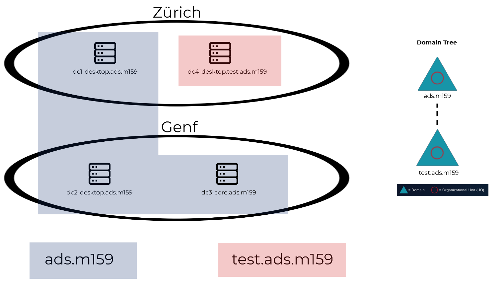
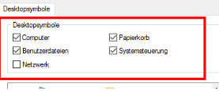

# Aufgabe 1 – Planen und VMs vorbereiten
## Einleitung:
In diesem Modul bauen Sie Ihre Active Directory-Umgebung schrittweise auf. Das Modul 159 ist modular aufgebaut, sodass Sie selbst bestimmen können, welche Aufgaben und somit auch welche Konfiguration Sie installieren.

Sie beginnen mit einer sorgfältigen Planung. Füllen Sie dazu die leeren Felder in der [Portfolio-Vorlage](./vorlagen/m159-portfolio.dockx) aus, damit Ihre Planung abgeschlossen werden kann.

Anbei erhalten Sie einen Überblick über Ihre zukünftige Umgebung:
- Ein bis zwei Standorte
- Ein bis vier Domänenkontroller (2 DCs an Standort 1 und 2 DCs an Standort 2)
- Einen «Domain Tree» bestehend aus zwei Domänen (1x Hauptdomäne und 1x Subdomäne)
- Pro Standort ein Windows 10 Client (Nicht im Bild enthalten)

Die Grafik oben zeigt Ihnen Ihre lokale Installation ohne Azure, wenn Sie zwei Standorte und die Subdomain einrichten. Diese Namen in der Grafik sind nur **Beispiele** und müssen von Ihnen neu und individuell definiert werden.

## Aufgabe Spezifikationen *(Portfolio)* `(1 Punkt)`
Füllen Sie im Portfolio, Punkt 3 Spezifikationen der Systeme aus.

Lesen Sie , auf was Sie bei der Wahl Ihres Domänenamen achten, sollten

Im Modul 159 möchten wir zwei Standorte simulieren. Sie können die Standorte frei wählen, zum Beispiel Zürich und Genf. Jeder Standort hat sein eigenes Subnetz, welches mit einem Router verbunden ist. Ein logisches Beispiel-Netzwerklayout finden Sie unter Punkt 2.2 in den Aufgaben im Repository.

> [!IMPORTANT]
> Füllen Sie das Portfolio komplett aus, auch wenn Sie später nicht alle Domänen, Maschinen und Standorte nicht installieren bzw. konfigurieren.

## Logische AD/Netzwerklayout *(Portfolio)* `(1 Punkt)`
Erstellen Sie mit Microsoft Visio oder mit [draw.io](draw.io) ein kombiniertes AD- und Netzwerklayout Ihrer kompletten Umgebung. Achten Sie darauf, dass sämtliche Standorte, Domänennamen, Computernamen (FQDN), IP-Adressen, Netzadressen und virtuelle Netzwerke im Layout vorhanden sind. 

## Aufsetzen der VMs
Setzen Sie die rohen VMs auf.

Iso Files können mit dem TBZ-Login unter: https://azureforeducation.microsoft.com/devtools
heruntergeladen werden

## Standardeinstellungen *(Praktische Überprüfung)* `(1 Punkt)`
Folgende Einstellungen müssen Sie auf sämtliches System vornehmen. Auf dem «Windows Core Server» müssen Sie lediglich 1.4.1 und 1.4.2 einstellen.

> [!TIP]
> Im Ordner resources finden Sie verschiedene PowerShell Skripte, mit dem Sie diese Aufgabe beschleunigen können. Dieses Skript wurde einst von einem sehr guten Schüler erstellt, es fehlen aber noch Einstellungen. Kannst Du das PS-File verbessern? Falls ja zeig deine Idee dem Lehrer.

### Server:
- **Aktuelle Uhrzeit & Datum** *(Core & Desktop)*
- **Firewall:** `Ping erlauben` *(Core & Desktop)*
- **Tastaturlayout:** `CH` *(Core & Desktop)*
- **Verstärkte Sicherheitskonfiguration für IE Im Server Manager Ausschalten** *(Desktop)*
- **Netzwerkadapter:** `IPv6 Deaktivieren` *(Core & Desktop)*
- **Anzeige & Ordneroptione**n *(Desktop)*
    - **Deaktivieren:** `Erweiterungen bei unbekannten Dateitypen ausblenden`
    - **Deaktivieren:** `Freigabeassistenten verwenden`
    - **Deaktivieren:** `Geschützte Systemdateien ausblenden`
    - Erstellen Sie eine **Verknüpfung** für **CMD** auf dem **Desktop**
    - Blenden Sie alle **Desktopsymbole ein**:
        
        

### Client
- **Aktuelle Uhrzeit & Datum**
- **Firewall:** Ping erlauben
- **Tastaturlayout:** `CH`
- **Netzwerkadapter:** `IPv6 Deaktivieren`
- **Ordneroptionen:**
    - **Deaktivieren:** `Erweiterungen bei unbekannten Dateitypen ausblenden`
    - **Deaktivieren:** `Freigabeassistenten verwenden`
    - **Deaktivieren:** `Geschützte Systemdateien ausblenden`
    - **Deaktivieren:** [`UAC`](https://support.microsoft.com/en-us/windows/user-account-control-settings-d5b2046b-dcb8-54eb-f732-059f321afe18) *(Unterste Stufe)*
    - Erstellen Sie eine **Verknüpfung** für **CMD** auf dem **Desktop**
    - Blenden Sie alle **Desktopsymbole ein**
## Spezifizierte Konfiguration auf den VMs festlegen *(Praktische Überprüfung)* `(1 Punkt)`
Machen Sie die Einstellungen auf den VMs, welche Sie im Portfolio unter Punkt 1 festgelegt haben.

Bereiten Sie Ihre Server für das Aufsetzen einer AD-Gesamtstruktur vor. Im Video «Active Directory-Installation vorbereiten.wmv» wird Ihnen gezeigt, was dazu alles gemacht werden muss. 
**Hinweis: Ihre DNS-Zone für das AD muss nicht wie im Video gezeigt vorher manuell erstellt werden**

> [!TIP]
> Erstellen Sie nach dieser Aufgabe Backup bzw. Snapshots von Ihren VMs, damit Sie im Falle wieder auf diesen Zustand zurückkehren könnten.

# Kontrolle:
Zusätzlich muss das [Portfolio](./vorlagen/m159-portfolio.dockx) **Abschnitt 1.1** für die Kontrolle dieser Aufgabe ausgefüllt und im MS Teams in Ihrem persönlichen Kanal abgelegt sein.
