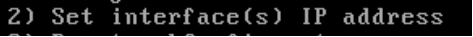
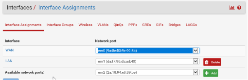

# Aufgabe 2 – «pf sense» installieren und konfigurieren – 1 Punkt
## Installation:
1. ISO-Datei herunterladen: `(https://www.pfsense.org/download/)`
1. Neue virtuelle Maschine erstellen
    - Zwei oder drei Netzwerkadapter (Konfiguration «VMnet» beachten) 
      *Zwei Adapter = Wie im Portfolio definiert*  
      *Drei Adapter = Ihre Umgebung hat zusätzlich noch ein Internetanschluss*
    - Boot type BIOS (Nicht UEFI)
    - 8GB Harddisk
    - 1GB Ram
1. ISO installieren
## Configuration:
1. pfsense Konfiguration
    - Konfigurieren Sie die IP-Adressen die erste LAN Schnittstelle
    
        

    - Nun können Sie über das Webinterface zugreifen und weitere Interfaces «assignen» 
        **Benutzer:** `admin` 
        **Passwort:** `pfsense`

    - Konfigurieren Sie die Interface assignments:
        

    - Firewall Regel kopieren
        Für das erste Interface erstellt «pfsense» automatisch eine «Default allow to any» Regel. Kopieren Sie diese Regel fürs zweite Interface und passen Sie die Schnittstelle und das Netzwerk an.

        

        

## Test:
Pingen Sie Server 1 von Server 2 aus und umgekehrt. Falls der ping ankommt, ist das Routing korrekt eingerichtet. 

***Achtung:** Machen Sie ein Backup, Snapshot oder Checkpoint vom Router, wenn er funktioniert.*

## Kontrolle:
Erstellen sie ein video in dehm sichtbar ist das sich die beiden server pingen können. Beim Video muss ersichtlich sein, dass es sich **um Ihre Umgebung handelt**.