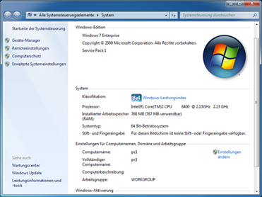
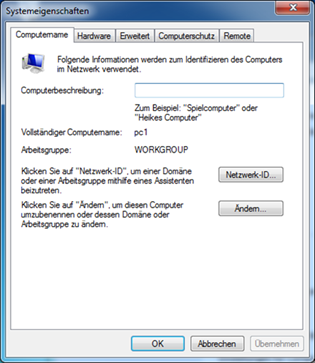
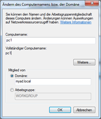
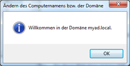
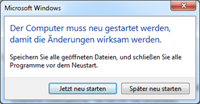

# **Aufgabe 4:** Client in Domäne einbinden `(1 Punkt)`

Damit der Computer im Active Directory verfügbar ist und Active Directory Benutzer sich anmelden können, muss der Client der Domäne hinzugefügt werden. Im Klartext: Der Computer muss ein Objekt im Active Directory werden.
Voraussetzung ist, dass der Domänencontroller und das DNS korrekt installiert sind. Windows 7/10 Home Premium und Basic können keiner Domäne hinzugefügt werden. Hierzu ist Professional, Enterprise, Ultimate oder Education notwendig.

## 4.1 Updaten Sie auch den «PTR-Record» für Ihre Clients in der DNS Reverse-Zone
1. Um den Client in die Domäne aufzunehmen unter Systemsteuerung\Alle Systemsteuerungselemente\System im Bereich Einstellungen für Computernamen, Domäne und Arbeitsgruppe den Punkt Einstellungen ändern aufrufen.

    

1. Im Reiter Computername auf Ändern klicken.

    

1. Den Name des Computers angeben. Dieser muss eindeutig sein und darf im Active Directory noch nicht vorhanden sein. Unter Domäne die URL der Domäne eintragen. Mit einem Klick auf OK, wird nach dem Domänencontroller gesucht. Wurde der Domänencontroller gefunden, erscheint ein Anmeldefenster.

    

1. Einen Domänenbenutzer angeben, der über die Rechte verfügt einen Computer der Domäne hinzuzufügen. Standardmäßig haben dieses Recht Domänen-Administratoren.

    

1. Warten sie bis das folgende Popup erscheint:

    

1. Nach einem Neustart ist der Computer der Domäne hinzugefügt.Domänenbenutzer können sich jetzt am Computer anmelden. Der neu hinzugefügte Domänencomputer befindet sich standardmäßig in der Organisationseinheit Computer.

    

## 4.2 Wichtig: Merken Sie sich folgenden für das Anmelden in Zukunft
- .\Logonname -> Anmeldung lokal am Client
- Computername\Logonname -> Anmeldung lokal am Client
- Domain\Logonname -> Anmeldung an Domäne über NETBIOS-Name
- Logonname@Domain -> Anmeldung an Domäne über DNS-Name