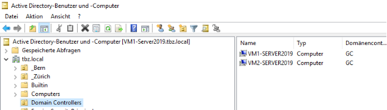

# Zusätzliche DCs hinzufügen & prompten `(1.5 Punkte)`
## Aufgabe 7 - DC2 zur Gesamtstruktur hinzufügen `(0.5 Punkte)`
Fügen Sie den zweiten DC(Desktop) wie im Video gezeigt zur vorhandenen Gesamtstruktur(Hauptdomäne) hinzu. 




## Aufgabe 7a – DC3 zur Gesamtstruktur hinzufügen `(1 Punkte)`
Fügen Sie nun den DC(Core) zur Hauptdomäne hinzu. Suchen Sie im Internet selbst nach einer Anleitung. Alternativ können Sie auch folgenden Link verwenden)
```ps1
# Domain Services Installieren
Install-WindowsFeature -Name AD-Domain-Services -IncludeManagementTools

# Server zu DC promoten
Install-ADDSDomainController -InstallDns -Credential (Get-Credential DomänenName\administrator) - DomainName DomänenName -SafeModeAdministratorPassword (ConvertTo-SecureString -AsPlainText "Passwort" -Force)
```
*https://docs.microsoft.com/en-us/answers/questions/59818/how-to-install-secondary-domain-controller-as-serv.html*